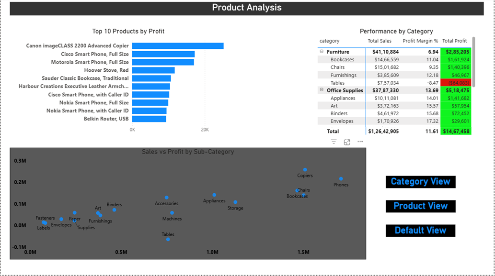
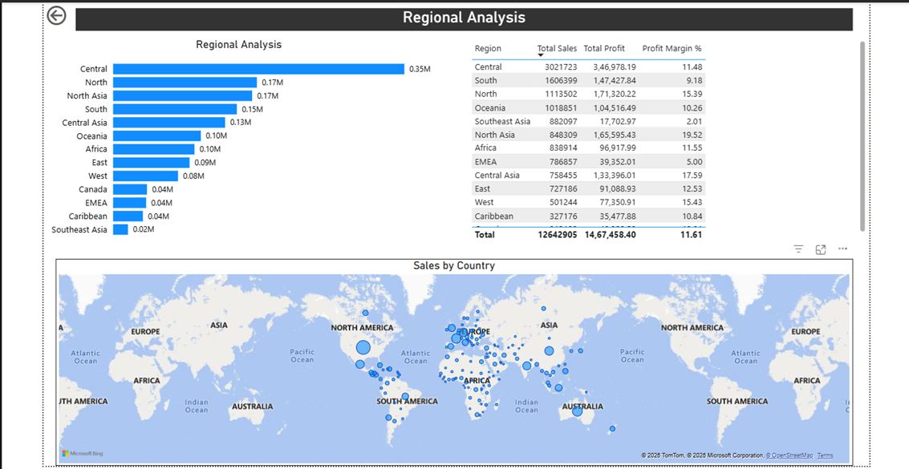

# Retail Sales Intelligence Platform

An end-to-end data analytics project built on the Global Superstore dataset — covering data cleaning, exploratory analysis, SQL-based business queries, and a Power BI dashboard.

---

## Project Overview

This project simulates a real-world retail analytics workflow:

1. Raw data ingestion and cleaning (Python / Pandas)
2. Exploratory data analysis — sales trends, profitability, customer segments
3. Business SQL queries for reporting (MySQL)
4. Interactive Power BI dashboard for stakeholder consumption

---

## Dataset

**Source:** [Global Superstore Dataset — Kaggle](https://www.kaggle.com/datasets/apoorvaappz/global-super-store-dataset)  
**Rows:** 51,290 orders  
**Coverage:** 2011–2014, global markets across 7 regions

> The raw CSV is not committed to this repository (see `.gitignore`).  
> Download `superstore.csv` from Kaggle and place it at `data/raw/superstore.csv` before running the notebooks.

---

## Repository Structure

```
retail-sales-platform/
│
├── data/
│   ├── raw/                  # Source CSV (not committed — download from Kaggle)
│   └── processed/            # Cleaned output generated by notebooks
│
├── notebooks/
│   ├── 01_load_and_clean.ipynb     # Load raw CSV, clean, feature engineer, export
│   ├── 02_eda.ipynb                # Exploratory data analysis (coming soon)
│   └── 03_sql_analysis.ipynb       # SQL business queries via MySQL (coming soon)
│
├── dashboard/                # Power BI .pbix file (coming soon)
│
├── .gitignore
├── requirements.txt
└── README.md
```

---

## Setup and Usage

**1. Clone the repository**
```bash
git clone https://github.com/<your-username>/retail-sales-platform.git
cd retail-sales-platform
```

**2. Install dependencies**
```bash
pip install -r requirements.txt
```

**3. Download the dataset**

Download `superstore.csv` from [Kaggle](https://www.kaggle.com/datasets/apoorvaappz/global-super-store-dataset) and place it at:
```
data/raw/superstore.csv
```

**4. Run the notebooks in order**
```bash
jupyter notebook notebooks/
```

Start with `01_load_and_clean.ipynb`. Each notebook reads from `data/processed/` and writes its output there for the next stage.

---

## Database Setup
This project uses MySQL. After installing dependencies:
1. Create a database called `retail_sales` in MySQL Workbench
2. Create a `.env` file in the project root with:
```
   MYSQL_PASSWORD=your_mysql_root_password
```

## Notebooks

### `01_load_and_clean.ipynb`
- Loads raw CSV with `latin-1` encoding
- Drops zero-value columns (garbled Chinese record-count column)
- Renames all columns to `snake_case`
- Parses `order_date` and `ship_date` to `datetime64`
- Engineers: `days_to_ship`, `order_month`, `order_quarter`, `profit_margin_pct`
- Guards against division-by-zero in margin calculation
- Exports `data/processed/cleaned_superstore.csv`

---

## Architecture

This project follows the **Medallion Architecture** pattern:

- **Bronze** — Raw data loaded as-is into MySQL (`superstore` table)
- **Silver** — Cleaned view with business logic columns (`silver_superstore`):
  - Zero-sales rows removed
  - `profit_status` — Profit / Loss flag
  - `ship_performance` — Fast / Standard / Slow based on days_to_ship
  - `discount_tier` — No / Low / Medium / High based on discount %
- **Gold** — Star schema optimised for reporting:
  - `gold_fact_orders` — 51,289 order line transactions
  - `gold_dim_date` — Continuous calendar table (1,461 days, 2011–2014)
  - `gold_dim_product` — 10,292 unique products
  - `gold_dim_customer` — 4,873 unique customers
  - `gold_dim_geography` — 3,635 unique locations

---

## Power BI Dashboard

**File:** `powerbi/retail_dashboard.pbix`

**Data model:** Star schema connected directly to MySQL Gold layer — 1 fact table, 4 dimension tables, all one-to-many relationships. `dim_date` marked as official Date Table for time intelligence.

**DAX Measures (12 total):**
Total Sales, Total Profit, Total Orders, Total Quantity, Profit Margin %, Avg Order Value, Sales LY, Sales vs LY %, YTD Sales, YTD Profit, Running Total Sales, Loss Orders

**Report Pages:**
- **Executive Summary** — KPI cards, monthly sales vs prior year trend, sales by region, sales by segment, year slicer
- **Product Analysis** — Top 10 products, category/sub-category matrix with conditional formatting, sales vs profit scatter chart, bookmark toggles
- **Regional Analysis** — Profit by region, regional table, global sales map, drill-through from other pages

**Row-Level Security:** 4 roles (Central Manager, North Manager, South Manager, APAC Manager) filtering on `dim_geography[region]`

## Dashboard Preview

### Executive Summary


### Product Analysis


### Regional Analysis


---

## Tech Stack

| Layer | Tool |
|---|---|
| Data cleaning & EDA | Python 3.11, Pandas, NumPy, Jupyter |
| SQL analysis | MySQL, MySQL Workbench |
| Dashboard | Microsoft Power BI Desktop |

---


## Author

**Rohit** — transitioning into Data / BI Analytics  
[LinkedIn - https://linkedin.com/in/rohit-kute-8457a8190] · [GitHub - https://github.com/rohitkute2017]
